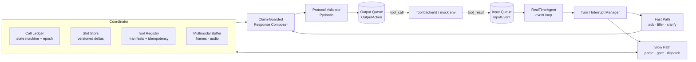

# Architecture — Interruptible Real-Time Agent (Theme 05)

Samsung Prism Gen AI 3.0 · fast-and-slow, interruption-safe, voice-native agent runtime.

This document describes the architecture **as implemented in the current codebase**, then lists verified gaps and a prioritized fix list. Status tags: ✅ implemented · 🟡 partial · ⛔ not wired.

---

## 1. Design goals (mapped to the scoring rubric)

| Rubric category | Weight | Architectural answer |
|---|---|---|
| Task Completion | 40% | Manifest-gated tool dispatch, slot-derived arguments, ledger-grounded final response |
| Interruption Recovery | 35% | Call ledger + epoch fencing + read-set invalidation, event-sourced slot store |
| Response Latency | 15% | Regex/template fast path, no LLM in the critical path, slot-echoing acknowledgments |
| Safety & Protocol | 10% | Two-phase commit gate, idempotency keys, Pydantic protocol models |
| Quality multiplier | 0.8–1.2× | Claim guard: completion language only from ledger state, capped fillers |

Core principle: **the agent never says or does anything that the ledger and slot store cannot justify.**

---

## 2. System overview



Everything runs on **one `asyncio` loop**, driven by an **injected `Clock`** (`RealClock` in production, `VirtualClock` in the harness). No module calls `time.time()` directly, which makes replay deterministic.

---

## 3. Module map

| File | Role | Status |
|---|---|---|
| `clock.py` | `Clock` ABC, `RealClock`, `VirtualClock` (`advance_to`, `sleep_ms` wakes sleepers deterministically) | ✅ |
| `protocol.py` | `InputEvent`, `OutputAction`, `StateSnapshot`, enums; validator requires `tool_name`/`call_id` on tool calls and `call_id` on cancels | ✅ |
| `agent.py` | Orchestrator: event dispatch, fast parse, selective invalidation, tool dispatch, result handling, response composition | 🟡 |
| `fast_path.py` | Slot-echoing acknowledgments, capped/varied fillers, clarification builder | 🟡 (`get_progress_filler` never called) |
| `slot_store.py` | `DifferentialSlotEngine`: versioned slots, delta updates, edit-marker lexicon | 🟡 |
| `ledger.py` | `CallLedger`: call state machine, epoch counter, read-set invalidation, stale-result check | 🟡 |
| `tool_gate.py` | `ToolRegistry`: manifest parsing, read-only vs state-modifying classification, two-phase gate, idempotency keys | 🟡 |
| `multimodal.py` | Ring buffers, deictic detector, frame-grounded query enrichment with confidence | 🟡 |
| `harness.py` | Virtual-clock replay, mock tool environment (400 ms latency), trace log, rubric-style scorer | 🟡 |
| `fuzzer.py` | Five adversarial-timing scenarios | ✅ |
| `tests/` | Unit tests for cancellation, idempotency, multimodal, slot repair | 🟡 (2 failing, see §8) |

---

## 4. Event flow

### 4.1 Text chunk (the main path)

1. **Self-repair check** — `parse_self_repair` looks for edit markers ("no wait", "actually", "make that"…) and, if found, keeps only the text after the marker.
2. **Multimodal grounding** — if the text has a visual deictic ("this error", "on my screen"), enrich it with the latest frame's OCR and objects. If frame confidence < 0.60 (or no frame), emit a **clarification** and stop.
3. **Fast parse** — regex intent + slot extraction (`flight_search`, `flight_book`, `manual_lookup`), sub-5 ms.
4. **Slot delta update** — only changed keys are written; returns the set of changed slots.
5. **Selective invalidation** — `invalidate_by_read_set(changed)` cancels only active calls whose read-set intersects the changed slots; a `CANCEL_CALL` is emitted for each.
6. **Fast-path acknowledgment** — slot-echoing text such as "Searching flights to Delhi on Friday…" (never completion language).
7. **Tool dispatch** — map intent → tool + args, run the gate, register a `CallRecord` (read-set, idempotency key, epoch), emit `TOOL_CALL`.

### 4.2 Interruption event

`bump_epoch()` → `invalidate_all_active()` → emit `CANCEL_CALL` per call → `fast_path.reset_turn()`. Slots are **preserved** so the next utterance can correct just one of them.

### 4.3 Tool result

1. Look up the `CallRecord`; drop if unknown.
2. **Fence:** `is_result_stale` drops results for cancelled calls or older epochs.
3. Mark `COMPLETED`, store the result.
4. `_compose_response` builds the spoken answer from the ledger record only, and emits `FINAL_RESPONSE` with a `StateSnapshot` (intent + slots).

---

## 5. Key mechanisms

### 5.1 Call ledger and epoch fencing
Each call moves through `PLANNED → ISSUED → RUNNING → COMPLETED | CANCELLED | SUPERSEDED | FAILED`. The epoch counter increments on every interruption. A result is accepted only if its call is live and its epoch is not older than the call's registration epoch. Late results from cancelled calls can therefore never produce speech.

### 5.2 Read-set selective invalidation
Every call records which slots it consumed. On a slot correction, only calls that read a changed slot are cancelled. A date-only lookup survives a destination change. This is the main lever for Interruption Recovery without wasting valid work.

### 5.3 Two-phase commit for state-modifying tools
- **Classification:** `is_state_modifying` from the manifest, with a name-keyword fallback (`book`, `create`, `pay`, …).
- **Phase 1 (gate):** all required slots present, each confidence ≥ 0.80, and `is_end_of_turn` true.
- **Phase 2 (commit):** `sha256(tool + canonical args)` must not already be in the executed-key set. The key is recorded when the call is issued.
- Read-only tools bypass both phases, enabling speculative execution on partial transcripts.

### 5.4 Differential slot store
Slots carry `value`, `version`, `turn_id`, `confidence`, `timestamp_ms`. `update_deltas` writes only changed values, so a correction never wipes unrelated context.

### 5.5 Fast path
Templates keyed by intent; acknowledgments echo only populated slots; filler budget is capped per turn (default 2) and never repeats a phrase; completion words are reserved for the composer.

### 5.6 Multimodal grounding
A deque of frames (10) and audio chunks (20). Deictic regex gates enrichment so generic phrases ("make that Friday") do not trigger visual grounding. Low visual confidence produces a clarification instead of a guess.

---

## 6. Data contracts (`protocol.py`)

```text
InputEvent   { timestamp_ms, event_type, session_id, payload, is_end_of_turn }
  event_type ∈ text_chunk | audio_clip | video_frame | interruption | tool_result | tool_manifest

OutputAction { timestamp_ms, action_type, call_id?, tool_name?, parameters?,
               text_content?, state_snapshot? }
  action_type ∈ spoken_filler | tool_call | cancel_call | clarification | final_response

StateSnapshot { intent?, slots{}, confidence, turn_id }
```

---

## 7. Test and evaluation tooling

- **Harness:** replays a timeline on the virtual clock, runs mock tools (400 ms latency, cancellable), logs every event and action, and scores with the 40/35/15/10 weights, quality multiplier, and 1.5× multimodal factor.
- **Fuzzer scenarios:** (1) self-repair, (2) duplicate-booking safety, (3) multimodal deictic grounding, (4) rapid double interrupt, (5) stale-result fence.
- **Current run:** fuzzer reports 5/5 passing; unit suite runs 16 tests with **2 failures**.

---

## 8. Verified gaps (found by running the code)

These were reproduced by running the uploaded fuzzer and tests.

| # | Gap | Evidence | Impact |
|---|---|---|---|
| 1 | **Self-repair does not apply the correction.** "Actually make that Delhi" is reduced to "make that Delhi", which matches no intent or slot regex, so the old `destination=Mumbai` is reused and a new Mumbai search is issued. | Fuzzer Test 1 trace: second call and final response are for **Mumbai** | Wrong arguments → Task Completion and truthfulness loss |
| 2 | **Harness scorer is too lenient to catch #1.** Interruption Recovery is 100 if *any* cancel exists; Task Completion is 100 if *any* final response exists, regardless of arguments. | Test 1 scores 105/100 despite the wrong city | Green tests hide real failures |
| 3 | **Unit test failure:** `is_result_stale` compares to the call's own epoch, so a bump after registration does not mark an un-cancelled call stale. | `test_epoch_bumping_and_stale_detection` | Fence semantics unclear for surviving calls |
| 4 | **Unit test failure:** `parse_self_repair("Mumbai, no wait, Delhi")` returns `", Delhi"` (leading punctuation not stripped). | `test_self_repair_edit_markers_detection` | Slot extraction on repaired fragments is brittle |
| 5 | **Fabricated booking arguments.** `_dispatch_tool` defaults `flight_id="AI-202"` and `passenger_name="Primary Traveler"`, so the required-slot gate can never fail. | `agent.py` `_dispatch_tool` | Risk of booking with invented data; should ask a clarification |
| 6 | **Idempotency key is committed at issue time and never released** if the call is cancelled or fails. | `record_commit` in `_dispatch_tool`, no release path | A legitimate re-issue after cancellation is blocked forever |
| 7 | **Dispatch is hardcoded to three tools** (`_fast_parse`, `_dispatch_tool`, `_compose_response`). | `agent.py` | Hidden set includes **unseen tools**; manifest-driven design is only half realised |
| 8 | **Interruptions are cancel-all only.** No taxonomy (backchannel / correction / addition / cancel-all), and in-flight state-modifying calls are cancelled without reconciliation. | `_handle_interruption` | Over-cancellation on backchannels; unsafe for bookings already sent |
| 9 | **Unwired components:** `get_progress_filler`, `_active_tasks`, `bump_turn`, `slots.clear`, `ToolRegistry.reset_session`, states `RUNNING`/`SUPERSEDED`/`FAILED`, retries, audio → slots (no ASR), `turn_id` always 0. | grep of call sites | Latency hiding, multi-turn tracking, fault handling incomplete |
| 10 | **Composer is not strictly grounded**: falls back to literals like `AI-202`, `10:00 AM`, `UNKNOWN`. | `_compose_response` | Quality multiplier / truthfulness risk |
| 11 | **Unnormalised slot values**: `error_code` becomes `"Error Code: ERR-502"`. | Fuzzer Test 3 tool params | Downstream lookups may miss |
| 12 | **Threshold mismatch**: docstring says 0.70, agent uses 0.60 for visual clarification. | `multimodal.py` vs `agent.py` | Inconsistent behaviour |
| 13 | **Protocol "validator" is construction-time only.** No final serialize-and-check gate before emit. | `protocol.py` | Malformed payload would surface as an exception, not a repair |

---

## 9. Prioritized fix plan

**P0 — correctness (do first)**
1. Rework self-repair: keep the **current intent**, parse the fragment as a *slot correction*, and map bare entities to the slot they replace (city → `destination`, weekday → `date`, flight-id pattern → `flight_id`). Strip leading punctuation in `parse_self_repair`.
2. Strengthen the harness scorer: assert expected tool, expected arguments, expected final snapshot, and that no stale-argument call or response appears. Add a failing test for gap #1 first.
3. Remove fabricated defaults: if a required slot is missing, emit a **clarification** instead of dispatching.
4. Release idempotency keys when a call is cancelled before execution or fails; keep them for completed/in-flight state-modifying calls.
5. Fix `is_result_stale` to compare against `current_epoch` for calls that were invalidated, and fix/adjust the two failing tests.

**P1 — generalization and scoring**
6. Make dispatch **manifest-driven**: derive intent → tool mapping and argument extraction from tool `parameters` (schema-constrained LLM extraction in the slow path, regex as fast prefilter). Remove `_TOOL_MAP`/per-tool branches.
7. Add the **interruption taxonomy** (backchannel vs correction vs addition vs cancel-all) and use read-set invalidation on interruptions, not only on text chunks.
8. For in-flight state-modifying calls on correction: attempt cancel, otherwise reconcile via an update/compensating call and state the outcome truthfully.
9. Wire `get_progress_filler` through a clock-based scheduler (speak only if the expected wait exceeds a threshold).

**P2 — multimodal and polish**
10. Audio path: ASR in the 300 s warm-up hook, feed transcripts into the same slot pipeline; acknowledge first, process behind it.
11. Normalise slot values (error codes, dates) and make the composer fail closed (no literal fallbacks).
12. Final payload gate: `model_dump` → schema check → emit; drop or repair on failure.
13. Extend fuzzing: interrupt at every offset relative to call issue, tool result, and commit; add fault injection (timeouts, errors, duplicate results).

---

## 10. Runtime constraints to respect

- Python 3.10–3.12; 120 s wall-clock per scenario; 300 s warm-up hook (load models here).
- Session-scoped memory only; no cross-session caching.
- Out of scope: wake-word detection, TTS tuning, UI.
